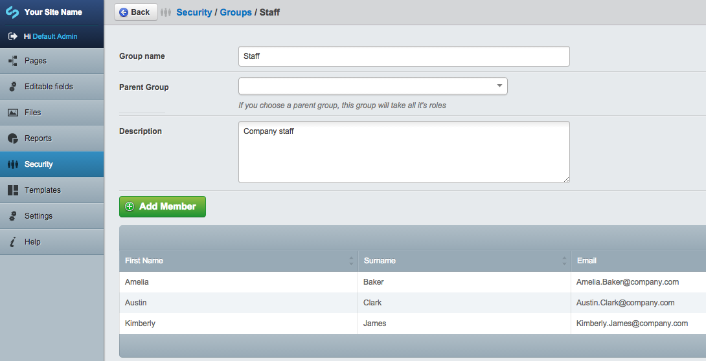
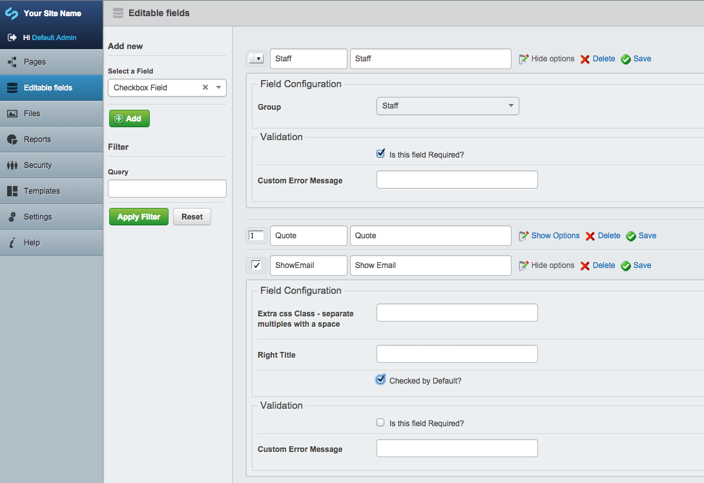
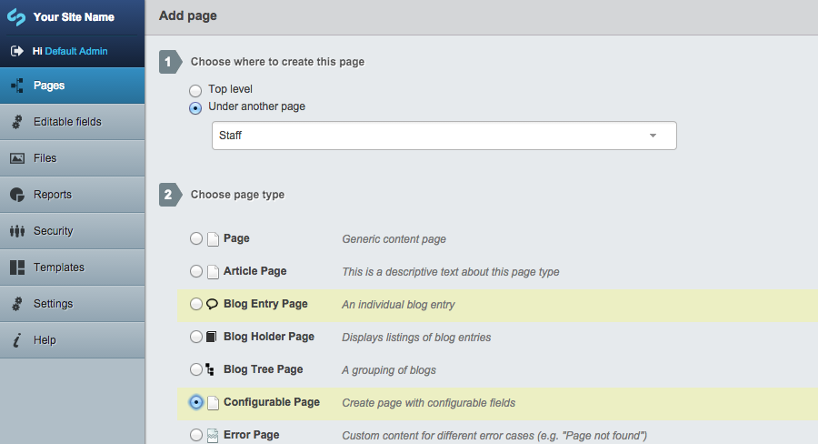
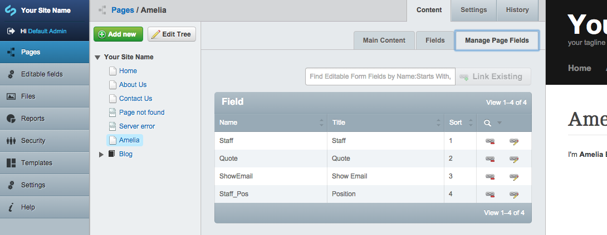
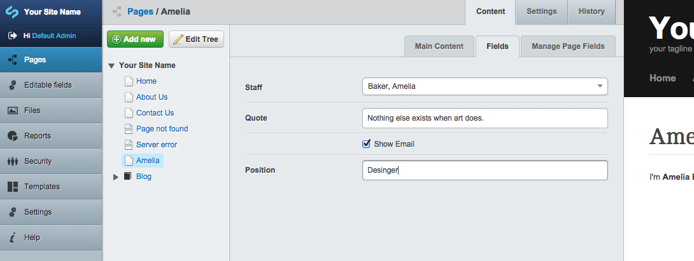
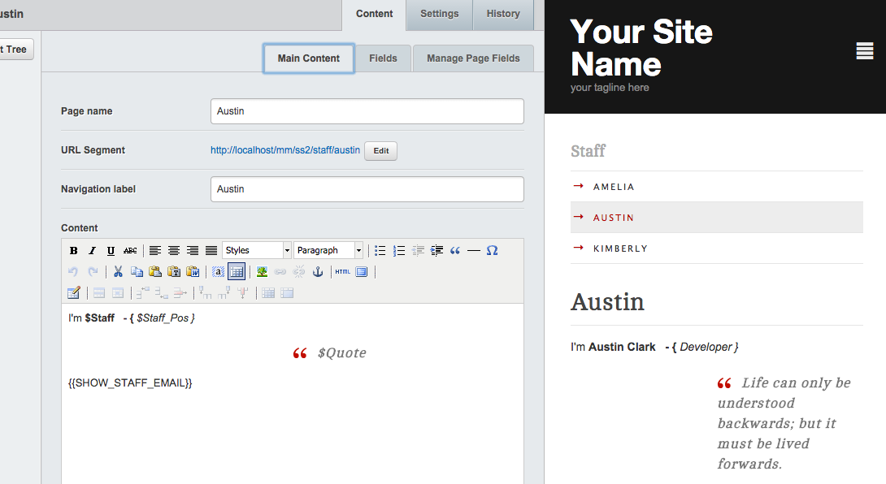
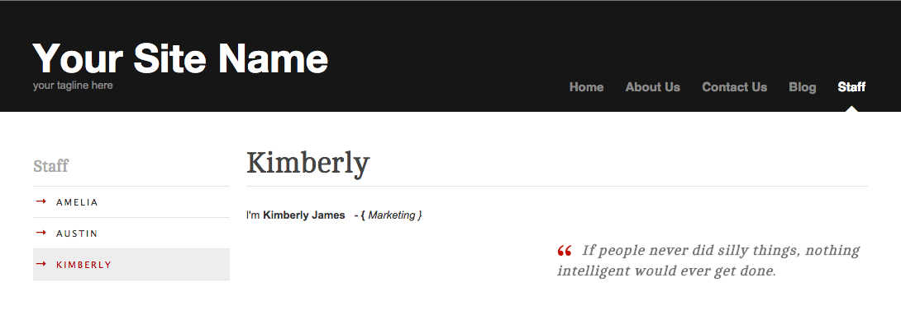
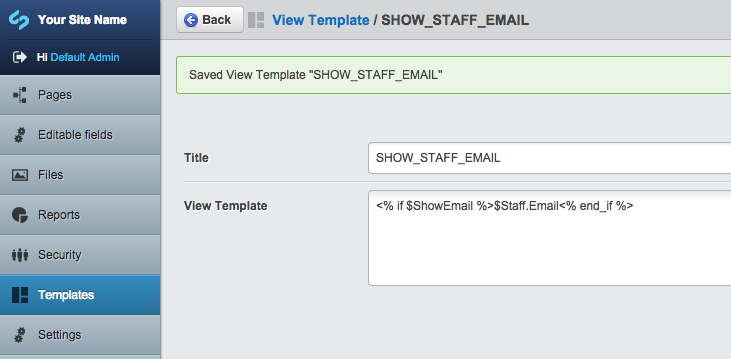

How to use Configurable Page (silverstripe-configurablepage)
==============

Below is an example explaining how to use this module. In this example we will create a simple staff page. A placeholder page **Staff** that contains a list of staff pages.

### Create staff accounts
On the first column of the CMS administration view, click **Security**. 

- Click on **Groups**.
- Create a group named **Staff**.
- Create a few accounts and make them a member of the **Staff** group.

### Create editable fields

- On the first column of the CMS administration view, click **Editable fields**.
- Create the fields as shown in the screenshot. **Read more** about [editable field module](https://github.com/satrun77/silverstripe-editablefield/tree/master/docs/en/user-docs.md).

### Create the staff pages

- On the first column of the CMS administration view, click **Pages**.
- Create a top level page named **Staff** (or any other name you would like). This will be a simple page.
- Use the **Under another page** option to create a sub-level page of type **Configurable Page**. This will be a child page of the **Staff** page.

- Click on the **Manage Page Fields** tab and search for editable fields created in the previous step.
  - The **Name** column of the grid fields show the value of this field to be used in the page content or template.
  - Double click on the **Sort** cell to enable editting and click enter or return on the keyboard to save the changes.
  
The link between the fields and the page has now been created.

- Click on the **Fields** tab to be able to add values to these fields for the current page only.
- **Known Issue:** At this time the contents will be empty. This should be fixed in future version. A workaround is to refresh the current page.
- Fill in the fields and then click **Save** button.

- Click on the **Main Content** tab to open the HTML editor. In the HTML editor you can refrence the value of the fields in the **Fields** tab by their Name.
 - Print out the staff favourite quote type `$Quote`.
 - Print out the staff full name type `$Staff`.

**You ask what is {{SHOW_STAFF_EMAIL}}? I will explain it in the next section, or you can read about the module [here](https://github.com/satrun77/silverstripe-viewtemplate/blob/master/docs/en/index.md).**

- Save your current page and publish it. Then duplicate this page with different details for another staff member. Your public site should look as follows:

You are now finished and have created a configurable page without any code :)

### Future improvements

Currently, to add a new field to the staff page (ie. link to personal site), you will have to edit each staff page and repeat the same steps.

- Link an editable field.
- Enter the value.
- Save changes.

In a future version, the module will include a feature that can handle this issue more efficiently (ie. create a editable field template instead of adding fields to page).

### How to create {{SHOW_STAFF_EMAIL}}

- You need to install [satrun77/viewtemplate](https://github.com/satrun77/silverstripe-viewtemplate)
- On the first column of the CMS administration view, click **Templates**.
- Create a template with the following:
  - Title: `SHOW_STAFF_EMAIL`
  - View Template: `<% if $ShowEmail %>$Staff.Email<% end_if %>`

- This is SilverStripe template language. It checks if ShowEmail is true then prints staff email address. **ShowEmail** and **Staff** are the names of the editable fields we created earlier.
- Go back to the staff pages you have created. You will need to edit each page created and enable the **View Template** module for each page (see View template docs for how to enable it).
- Add the placeholder to the content of the page then publish the page and view the end result.
- Email address is only visible if you have ShowEmail ticked.
